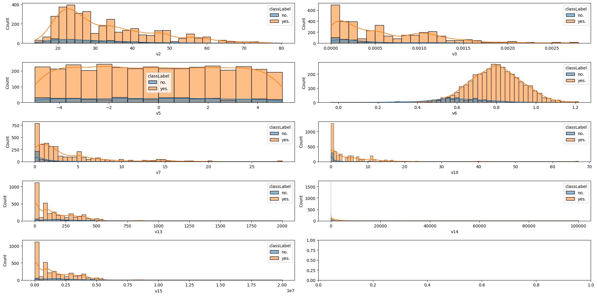
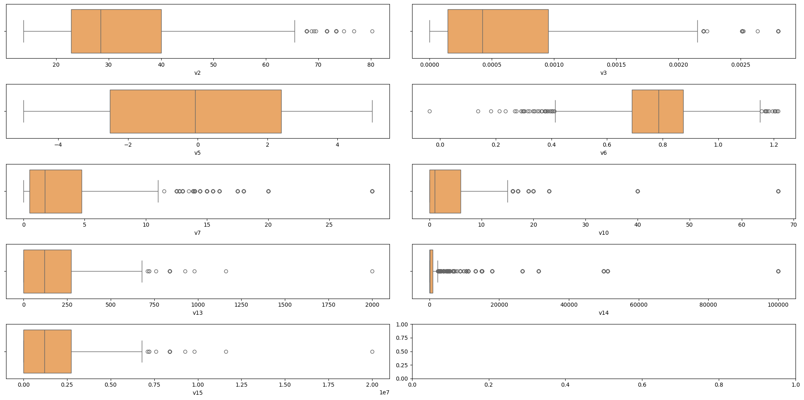
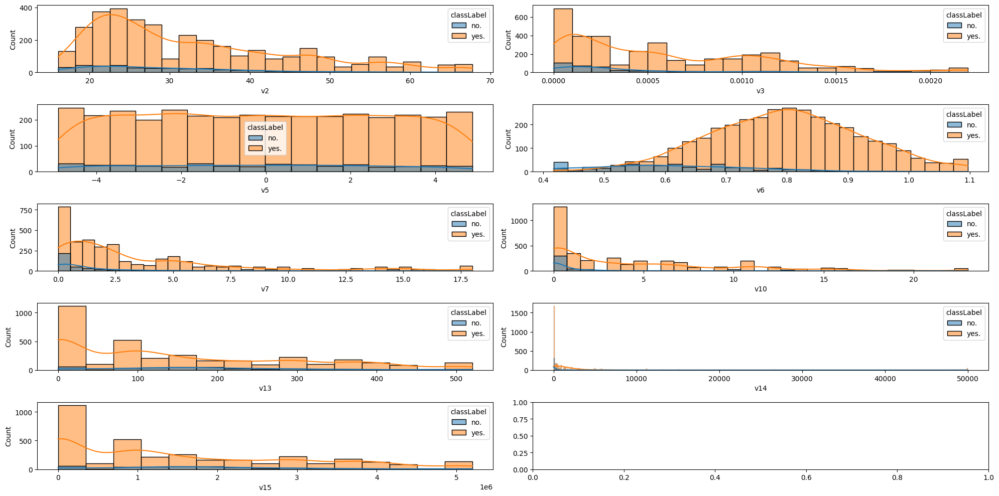
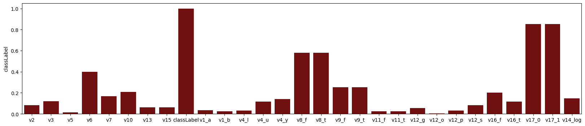
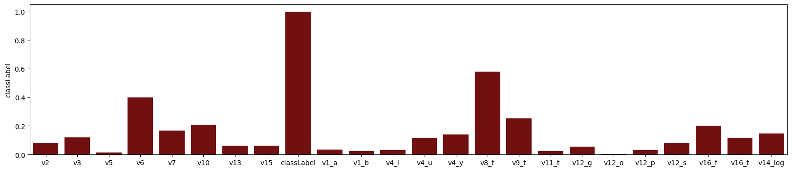

# Binary Classification Task

## Problem Statement:
The task at hand is a binary classification problem, for which both a training and a validation data set are provided as csv files.

We would like you to explore both data sets, note down your key observations along with a short summary / visualization and work on this classification task by building a classifier only with the training data, with the goal of achieving the best performance possible on the validation data. You are allowed to manipulate / remove any independent variables in either data set in any way you see fit to achieve this goal.

You are free to choose any programming to complete this task, and would prefer Python.

We would like to get any code you write for this project, and would appreciate it if it was at least informally commented so that it’s easier to read for us.

## Data Preparation:
* We have both `training` and `test` dataset.
* Load the dataset into pandas df and add a column: `type` with values = `test`/`train`. We do this because we want to `concatenate` both the datasets and perform the cleanup.
* After cleaning the dataset, we can split the dataset into `test` and `train` datasets and split `features` and `classification` from each dataset and use it in building the `classification` model.

## Data Cleaning:
* Segregate `numerical` and `categorical` columns.
* It looks like we have `,` in the values to represent decimal points and we have a few values in `scientific notation`.
* Fix all the `numerical` columns, by replacing `,` with `.` and convert into floating points.
* Fix `null` values.
    * We can either `drop these records`, or `replace with 0s`. But since we don't know what the columns represent, replacing the null values seems like a safer option.
    * In some columns, 0 seems to be a large value, so filling the null values with `10th quantile percentage` value could be better.
* For `categorical` columns, use `one-hot encoding`, by creating new columns for each category, and `encode` with `values = 0/1`.

## Data Exploration:
* Use `boxplot` or `histogram` plot, check how the values are `distributed` in all the numerical columns.
* Observation: we have quite a few `outliers` and it is essential to deal with these outliers.

    * Most of the times, outliers lies well outside of 99th quantile percentage. This is usually due to `erroneous` entries.
    * We can either `remove` these records, or `cap the values` with the 99th quantile percentage value up and down.
* After capping the values, `column: v14` still looks off on the distribution. On a closer look, it looks like values are increasing `exponentially`, ranging from 0 to 100000.

* Hence we transform this column and create a new column `v14_log = log(v14)` and drop the original column: v14.

## Feature Selection:
* Generate a correlation matrix.
* Check how the columns are correlated to `classLabel`.

* Find and remove the columns that has the `same (and opposite) correlation coefficient` with classLabel. This is usually the case with the encoding the categorical columns with only 2 values in it. 
* Remove the column that has `correlation coefficient close 1/-1`. This will most likely be a `data leak`. 
* Observation: There are a few columns that has a very small correlation coefficient with the classLabel. This doesn't necessarily mean we should be removing these columns, rather we need to deal with these whilst building the models. 

## Model Building and Comparison:
Use the sklearn package to import packages for each classification methods, fit, predict and compare scores.
1. *KNN Classification*:
Finds the euclidean distance of each feauture in the test dataset with all the feautures in the training dataset, sort the distance in ascending order, find the first N feautures (`neighbors`), and assign the maximum number of classification `y` observed.

    * I used n_neighbors = 5, fit and predict the classification. Accuracy was a bit low with `value = 0.57`, initially.
    * I removed the columns with very low correlation coefficient with the classification. Accuracy improved a bit to 0.725

2. *Logistic Regression*:

Logistic Regression, iteratively establish a logistic relationship `logit function` between the available features and its classification, and the relationship is then used to predict the probability of an event occuring or not. `y = 1/(1 + e**(-w*x + b))`.

3. *Naive Bayes Classification*: 

I used the Gaussian Naive Bayes classifier with all the features, achieving an accuracy of 0.46. Next, I focused only on the numerical columns, but the accuracy didn’t improve significantly. After that, I removed all features that did not follow a Gaussian distribution and retrained the model. This resulted in a slight improvement in accuracy, bringing it up to 0.6.

Final accuracy scores of the models:

|`CLASSIFIER`|`ACCURACY`|
|----------|--------|
|knn|**0.710**|
|Logistic Regression|**0.610**|
|Naive Bayes (Gaussian)|**0.605**|